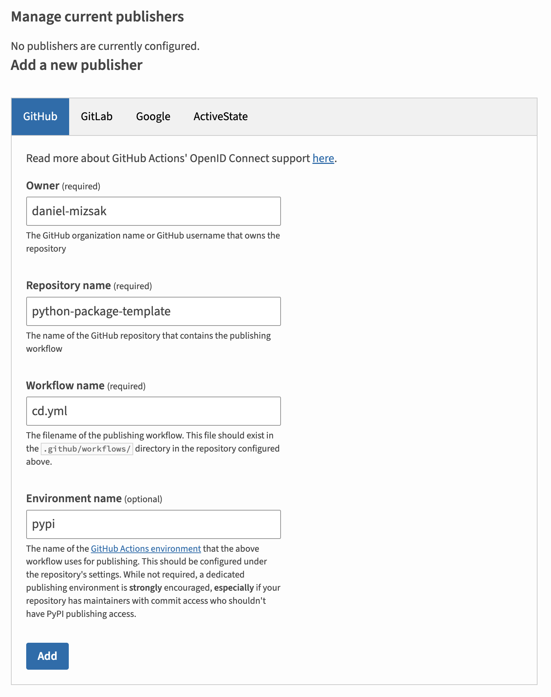

# PyPI

[PyPI](https://pypi.org){target} (Python Package Index) is the official Python package registry.

I use it to publish my Python solutions, so it can be installed via `pip` (or `uv`).

Add a new publisher:

<figure markdown="span">
  { width="400" }
  <figcaption>PyPI Publisher</figcaption>
</figure>

My publishing workflow is the following (see it in action in `.github/workflows/cd.yml`):

- Every time a tag is pushed to the `main` branch, I run the `.github/workflows/ci.yml` workflow.
- This workflow builds the package (using my [reusable python-ci GitHub Workflow](https://github.com/daniel-mizsak/workflows/blob/main/.github/workflows/python-ci.yml){target}) and uploads the generated build files as an artifact.
- Once this job ran successfully, the `pypi-publish` job downloads the artifact and publishes it using the `ypa/gh-action-pypi-publish` action.
